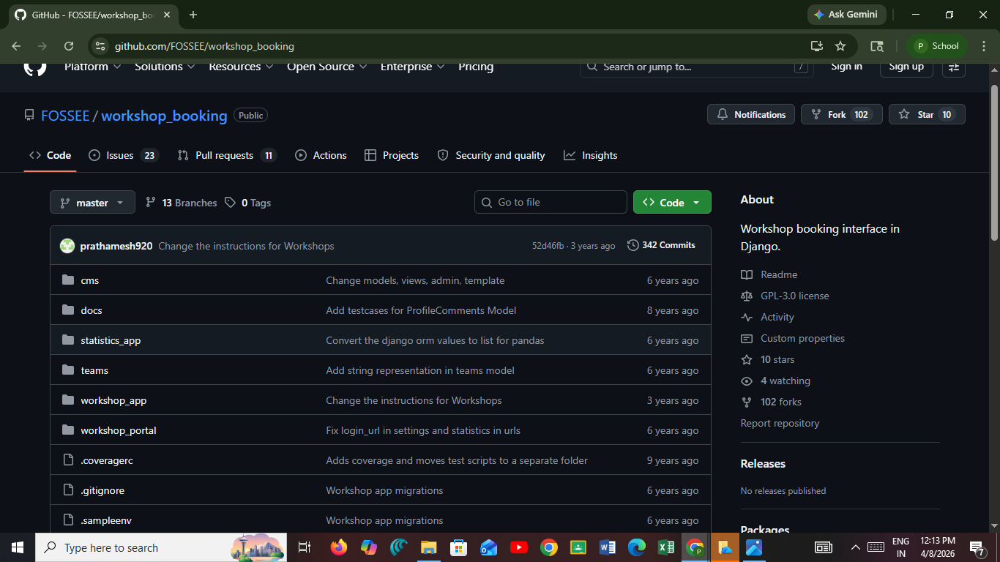
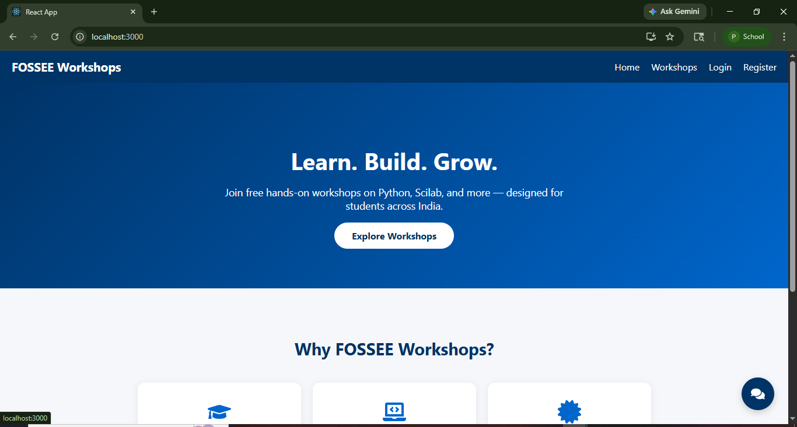
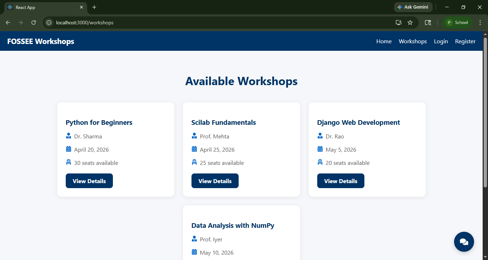
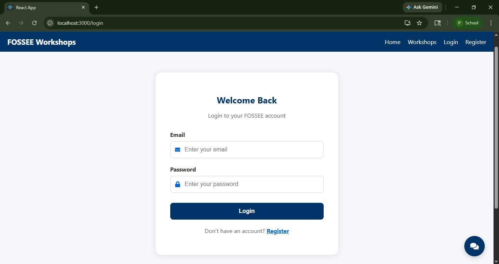
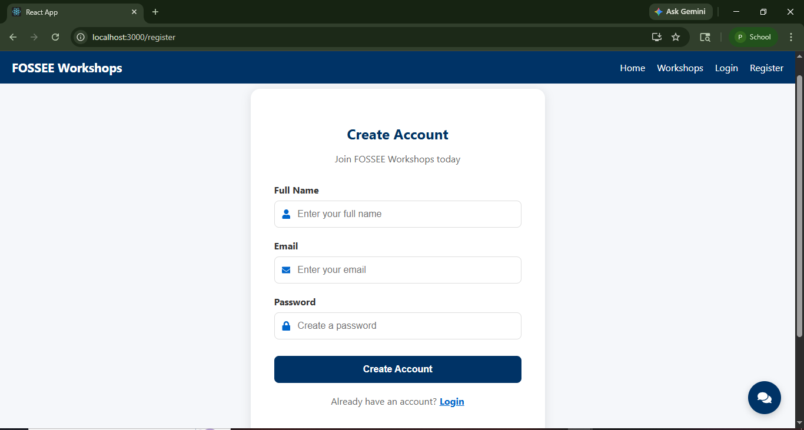

# FOSSEE Workshop Booking - React Redesign

A modern, mobile-friendly React redesign of the FOSSEE Workshop Booking portal.

## Setup Instructions

1. Clone the repository
   git clone https://github.com/pujaux/fossee-workshop-redesign.git

2. Go to frontend folder
   cd frontend

3. Install dependencies
   npm install

4. Start the app
   npm start

5. Open in browser
   http://localhost:3000

---

## Design Principles

- Mobile-first design so students on phones can use the site easily
- Clear visual hierarchy using headings, cards and whitespace
- Consistent color scheme using FOSSEE blue (#003366)
- Accessible fonts and readable contrast ratios
- Sticky navbar for easy navigation on all screen sizes

---

## Responsiveness

- Used CSS flexbox with flex-wrap so cards stack on small screens
- Navbar has a hamburger menu that opens on mobile
- All padding and font sizes adjusted for small screens
- Tested on both desktop and mobile viewport sizes

---

## Trade-offs

- Used inline styles for speed of development instead of a CSS framework
- Kept data as static arrays instead of connecting to Django backend
- Focused on UI quality over complex functionality within the time limit

---

## Most Challenging Part

The most challenging part was making the navbar responsive on mobile. I solved this by using React useState to track whether the menu was open or closed,toggling a CSS class to show or hide the links on small screens.

---

## Before and After Screenshots

### Before (Original Django Codebase)

### After (React Redesign)

